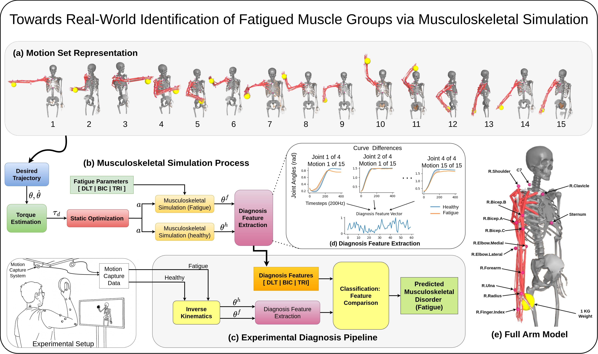

# Simulation-Driven Fatigue Diagnosis

This repository contains the official implementation for our ICRA 2026 paper on simulation-driven identification of fatigued upper-limb muscle groups using musculoskeletal simulation and motion analysis.



## Features

- Musculoskeletal simulation using MyoSuite + MuJoCo
- Fatigue-aware motion generation
- Diagnosis feature extraction
- Simulation-to-real fatigue comparison
- Experimental fatigue classification


## Installation

```bash
git clone ...
cd repo

pip install -r requirements.txt
```
